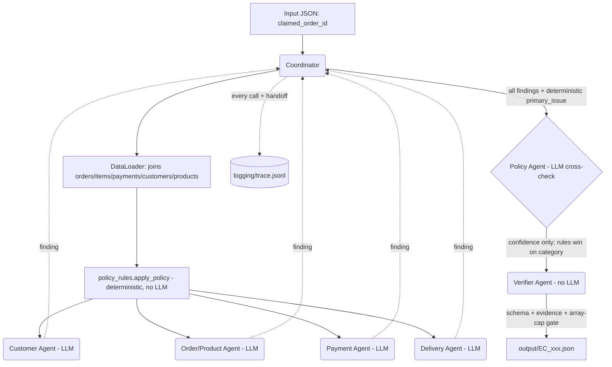

# Architecture: Tool-Augmented Multi-Agent System

Every graded number and category (`primary_issue`, refunds, entities, evidence...)
is computed deterministically in `src/policy_rules.py` from data the domain
agents extract - arithmetic and rule precedence are exactly what a small model
gets wrong. On top of that, each domain agent makes **one real LLM call**
(Groq `llama-3.1-8b-instant`) over its own pre-computed facts to produce a
narrative judgement and, for the Policy Agent, an independent classification
used as a cross-check. The LLM's reply is reconciled against the deterministic
facts in `validate()`: rules always win for graded fields, and the model's
agreement/disagreement only changes `case_assessment.confidence`. If the LLM
is unreachable or returns something invalid, `fallback()` derives the same
finding from the facts, so a case is never dropped and grading never depends
on the network.

## 1. Agent Roles and Handoff Flow

## 2. Agent Responsibilities

- **Coordinator** (`src/coordinator.py`): parses `claimed_order_id`, calls `policy_rules.apply_policy()` for the deterministic core, dispatches every domain agent with just the facts it owns, assembles the final JSON, and writes every step to the trace.
- **Customer Agent** (`src/agents/customer_agent.py`, LLM): judges whether the customer is a repeat customer from `customer_unique_id`/`related_order_ids`. `customer_context` itself is built deterministically (`build_customer_context`).
- **Order & Product Agent** (`src/agents/order_product_agent.py`, LLM): judges multi-item/multi-seller/multi-category from the joined item/seller/product/category facts. `affected_entities`/`product_context` are built deterministically.
- **Payment Agent** (`src/agents/payment_agent.py`, LLM): reads the pre-computed reconciliation (`item_total`, `freight_total`, `difference_brl`, `reconciled`) and narrates it; never recomputes the arithmetic.
- **Delivery Agent** (`src/agents/delivery_agent.py`, LLM): reads the pre-computed `delivery_variance_hours` / per-seller `handoff_variance_hours` and attributes blame (seller vs logistics_provider vs none); never recomputes the date math.
- **Policy Agent** (`src/agents/policy_agent.py`, LLM): classifies `primary_issue` independently from the upstream findings, as a cross-check against `policy_rules.determine_primary_issue()`. The deterministic result is always what ships; agreement sets `confidence=0.95`, disagreement `0.75`, no-LLM-available `0.80`.
- **Verifier Agent** (`src/agents/verifier_agent.py`, no LLM): assembles the Pydantic schema, enforces every array cap from README section 6, and cross-checks IDs/timestamps/evidence against the data actually loaded for the order before the file is written.

## 3. Deterministic core

`src/policy_rules.py` is pure Python with no LLM involvement: it implements
`EC_POLICY_V2`'s priority table (`canceled_order_paid` -> ... ->
`unsupported_late_claim`), secondary issues, responsibility, refund amount,
resolution actions and evidence IDs exactly as specified in README section 4-5.
This is the single source of truth every agent and `audit_outputs.py` reads
from, so the LLM layer can be added, removed, or swapped without changing a
single graded value.

## 4. Observability: the trace is the proof

`src/trace_logger.py` writes one JSON line per event to `logging/trace.jsonl`:
an `a2a_message` for every Coordinator -> agent handoff, and an `agent_step`
for every agent's execution (including its LLM call, latency, token usage and
any error). This makes the multi-agent flow something you can grep, not just
something described in this document.

## 5. Independent audit before submission

`audit_outputs.py` re-derives the expected `case_assessment`,
`delivery_analysis`, `payment_reconciliation`, `evidence_ids` and
`resolution_actions` straight from the CSVs via `policy_rules.apply_policy()`
- written separately from `verifier_agent.py` so a bug in the verifier
wouldn't be masked by reusing its own logic - and diffs them against every
file in `output/`. Run `python audit_outputs.py` before zipping `output/` for
submission.

## 6. Data access & security

- The LLM never sees raw CSV rows or credentials - only the pre-computed fact
  sheet each agent builds for it.
- Python (`data_loader.py`, `policy_rules.py`) is used for data extraction and
  arithmetic, never for the LLM's own business-rule reasoning to override.
- `GROQ_API_KEY` is read from `.env` (see `.env.example`) and never committed;
  `src/llm_client.py` is the only place that reads it.
