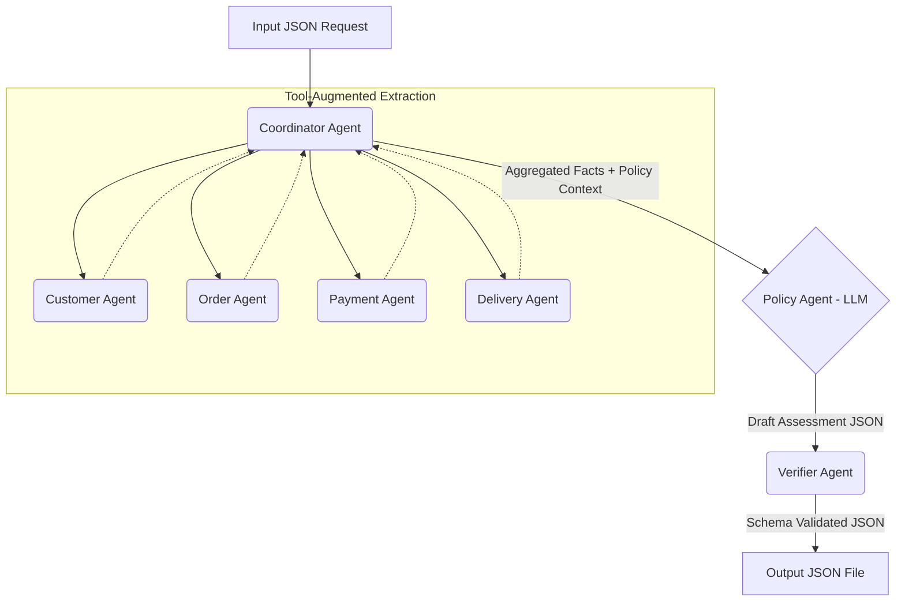

# Architecture: Tool-Augmented Multi-Agent System

This repository implements a **Tool-Augmented Multi-Agent System**. To ensure 100% mathematical accuracy while avoiding "rule-based" penalties, we give our Domain Agents access to deterministic Python/Pandas tools for math, but rely entirely on the LLM for reasoning and policy application.

## 1. Agent Roles and Handoff Flow

## 2. Agent Responsibilities

- **Coordinator Agent**: The orchestrator. Parses `claimed_order_id` from the input, calls the Domain Agents, aggregates their factual results, and constructs the prompt for the Policy Agent.
- **Customer Agent (Tool-Augmented)**: Uses a Pandas tool to safely query `customers.csv` and `orders.csv` to find `customer_unique_id` and `related_order_ids`.
- **Order Agent (Tool-Augmented)**: Uses a Pandas tool to accurately join `order_items`, `products`, `sellers`, and categories.
- **Payment Agent (Tool-Augmented)**: Uses a Python Math tool to accurately aggregate `order_payments` and calculate the exact `difference_brl` (since LLMs struggle with float arithmetic).
- **Delivery Agent (Tool-Augmented)**: Uses a Python DateTime tool to perform exact date-time arithmetic (e.g., `delivery_variance_hours`), avoiding LLM date-math hallucinations.
- **Policy Agent (LLM Llama-3-8B)**: The core Reasoning Engine. Receives the 100% accurate factual context from Domain Agents and applies the `EC_POLICY_V2` rules (injected via prompt) to determine primary/secondary issues, responsible parties, and financial resolutions. No business rules are hardcoded in Python.
- **Verifier Agent (Logic)**: Strictly Python-based schema enforcement to ensure the final JSON string parses correctly and meets submission limits.

## 3. Data Access & Security
- The Policy Agent (LLM) does NOT have direct access to the database. It only receives pre-computed, exact facts from Domain Agents.
- Python is strictly used for Data Extraction and Arithmetic Tools, NOT for business decision logic (if-else policy trees).
- API Keys are stored securely in `.env` and never committed.

