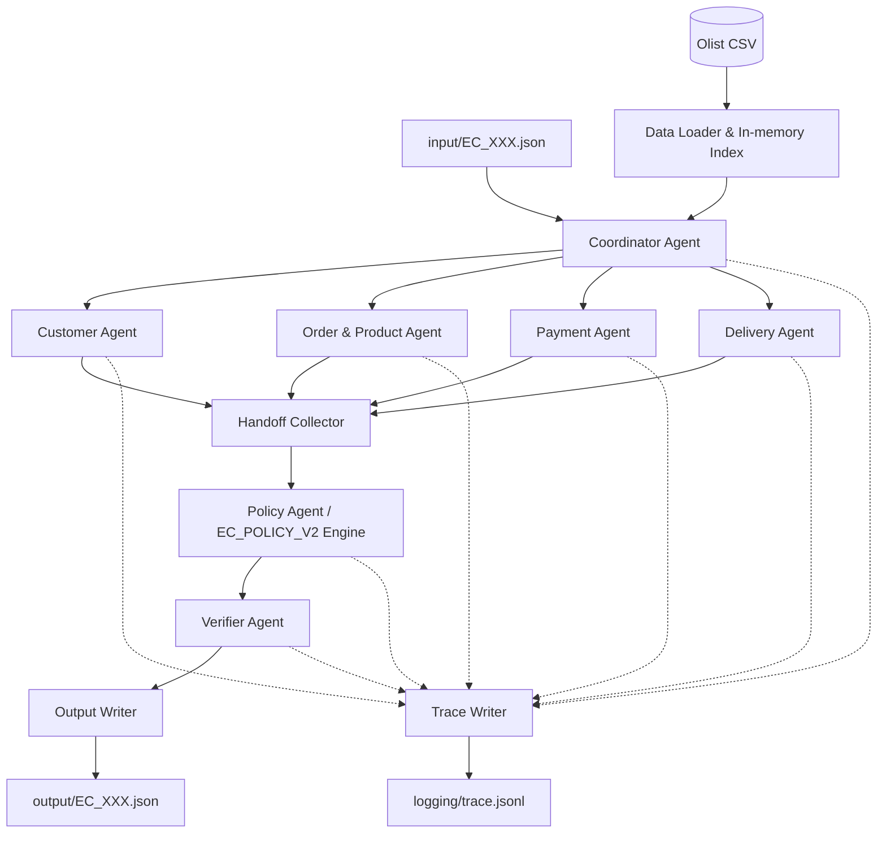

# Kiến trúc Multi-Agent E-commerce Dispute Resolution

**Trạng thái:** Accepted for MVP
**Phạm vi:** xử lý 50 case `EC_001`–`EC_050` trên Brazilian E-Commerce Public Dataset by Olist.
**Mục tiêu:** tạo đúng một output JSON hợp lệ cho mỗi input, có thể kiểm chứng bằng dữ liệu CSV và có trace của lần chạy gần nhất.

## 1. Yêu cầu và ràng buộc

- Input gồm 50 file JSON trong `input/`.
- Dữ liệu nguồn nằm trong `data/`; các bảng chính là orders, customers, order items, payments, products và sellers.
- Policy cố định là `EC_POLICY_V2` trong `README.md`.
- Output phải gồm đúng 50 file `output/EC_001.json` đến `output/EC_050.json`.
- Evidence chỉ được tham chiếu bằng ID dựng trực tiếp từ dữ liệu:
  `order:`, `item:`, `payment:`, `seller:` và `policy:`.
- Mọi số tiền và số giờ phải được làm tròn 2 chữ số.
- Model của mỗi agent không vượt quá 10B tham số.
- `logging/trace.jsonl` chỉ chứa trace của lần chạy mới nhất; không append giữa các lần chạy.
- Secret chỉ được đọc từ `.env`, không ghi vào source, output, trace hoặc metadata.

## 2. Nguyên tắc thiết kế

1. **Dữ liệu và rule là nguồn sự thật.** LLM không được tự sinh ID, số tiền, timestamp hoặc sự kiện không có trong CSV.
2. **Tính toán deterministic.** Join dữ liệu dùng index trong bộ nhớ; tiền dùng `Decimal`; timestamp dùng `datetime`.
3. **Agent có ranh giới rõ ràng.** Mỗi agent có input, output, quyền đọc và evidence riêng.
4. **Fact agents chạy song song.** Customer, Order & Product, Payment và Delivery đều đọc dữ liệu chỉ-đọc.
5. **Một nơi ghi output.** Chỉ Coordinator/Output Writer được ghi file; Verifier chỉ phê duyệt hoặc yêu cầu sửa.
6. **Structured handoff.** Agent chỉ giao JSON envelope, không giao prose tự do làm đầu vào cho agent tiếp theo.
7. **LLM có fallback.** Nếu model lỗi hoặc trả JSON không hợp lệ, pipeline dùng kết quả deterministic và ghi warning vào trace.

## 3. Kiến trúc tổng thể



Đây là **modular monolith**, không tách thành microservice ở MVP. Các agent là module/process logic độc lập; model có thể được phục vụ bởi một hoặc hai model server dùng chung.

## 4. Các agent và model

| Agent | Model đề xuất | Vai trò chính | Output bàn giao |
|---|---|---|---|
| **Coordinator** | `Qwen2.5-7B-Instruct` | Validate input, tạo context, dispatch, thu thập handoff và điều phối retry | `CaseContext`, trạng thái pipeline |
| **Customer** | `Qwen2.5-3B-Instruct` | Xác định customer và lịch sử order; join chính do code thực hiện | `customer_context`, related orders, evidence |
| **Order & Product** | `Qwen2.5-7B-Instruct` | Đọc order, item, seller, product và category | order facts, affected entities, product context |
| **Payment** | `Phi-4-mini` + `Decimal` engine | Tổng hợp payment và đối soát item + freight | payment reconciliation, payment evidence |
| **Delivery** | `Qwen2.5-7B-Instruct` + `datetime` engine | Tính delivery variance và seller handoff variance | delivery analysis, late seller IDs |
| **Policy** | `DeepSeek-R1-Distill-Qwen-7B` + rule table | Xếp primary issue, root cause, responsibility, refund và actions | policy decision |
| **Verifier** | JSON Schema/Python; `Qwen2.5-7B-Instruct` chỉ làm repair fallback | Kiểm tra schema, ID, evidence, số tiền, null và giới hạn mảng | `valid`, lỗi kiểm tra hoặc output đã sửa |

### Groq runtime profile

Khi chạy qua Groq, cả 7 logical agent đều gọi model `llama-3.1-8b-instant` (8B, không vượt 10B). Mỗi case có 7 request: Coordinator, bốn fact agent, Policy và Verifier. Model chỉ review handoff facts và candidate snapshot; reference engine và Verifier deterministic là nguồn quyết định cuối cùng.

Runtime production được bật bằng `LLM_REQUIRED=true`. Client dùng JSON mode, retry có backoff khi timeout/429/5xx, và throttle theo `LLM_MIN_INTERVAL_SECONDS` để không vượt rate limit. Nếu request báo lỗi trong required mode, case không được ghi output.

Model chỉ hỗ trợ việc đọc/diễn giải và handoff. Các phép tính sau luôn do code quyết định:

- `expected_total_brl`, `difference_brl`, `reconciled`;
- `delivery_variance_hours`, `handoff_variance_hours`;
- kiểm tra tồn tại của order/item/payment/seller/product;
- thứ tự primary issue, secondary issues và actions;
- giới hạn số lượng phần tử trong output.

### Model pool

Không cần tải bảy bộ model riêng biệt:

- `qwen7b` dùng chung cho Coordinator, Order & Product, Delivery và Verifier repair;
- `qwen3b` dùng cho Customer;
- `phi4mini` chỉ bật cho Payment khi cần giải thích/anomaly review;
- Policy có thể gọi DeepSeek riêng hoặc dùng rule engine khi chạy offline.

Nếu thiếu GPU hoặc model server, toàn bộ pipeline vẫn phải chạy bằng Data Loader + deterministic agents và sinh output hợp lệ.

## 5. Quyền truy cập

| Thành phần | Được đọc | Được ghi |
|---|---|---|
| Data Loader | Toàn bộ CSV cần thiết | Không ghi |
| Customer Agent | customers, orders, input case | Không ghi |
| Order & Product Agent | orders, order_items, products, sellers, category translation | Không ghi |
| Payment Agent | order_items, order_payments | Không ghi |
| Delivery Agent | orders, order_items | Không ghi |
| Policy Agent | Các handoff đã được kiểm tra | Không ghi |
| Verifier Agent | Candidate output và read-only indexes | Không ghi output trực tiếp |
| Coordinator / Output Writer | Input, handoff, verifier result | `output/*.json`, `logging/trace.jsonl` |

`order_reviews_dataset.csv` và `olist_geolocation_dataset.csv` không được dùng để suy diễn policy hiện tại vì chúng không nằm trong output contract và không có evidence ID tương ứng. Có thể mở rộng sau khi policy cho phép.

## 6. Data Loader và index

Data Loader đọc CSV một lần khi khởi động và tạo các index:

```text
orders_by_id[order_id]
customers_by_id[customer_id]
customer_orders_by_unique_id[customer_unique_id]
items_by_order[order_id]
payments_by_order[order_id]
products_by_id[product_id]
sellers_by_id[seller_id]
category_translation_by_name[product_category_name]
```

Các index phải bảo toàn thứ tự dòng nguồn để các array output ổn định. Khi thiếu dữ liệu:

- order không tồn tại: case lỗi input, không được tạo evidence giả;
- order không có item: `item_total_brl`, `expected_total_brl`, `difference_brl` và `reconciled` là `null`;
- payment vẫn được tổng hợp độc lập kể cả khi order không có item;
- timestamp thiếu: giữ `null`, không tự nội suy.

## 7. Handoff contract

Mọi agent dùng envelope chung:

```json
{
  "case_id": "EC_001",
  "agent": "payment",
  "status": "ok",
  "facts": {},
  "evidence_ids": [],
  "warnings": [],
  "confidence": 0.0
}
```

### Customer handoff

```json
{
  "customer_unique_id": "<customer_unique_id>",
  "related_order_ids": ["<other_order_id>"],
  "evidence_ids": ["order:<claimed_order_id>"]
}
```

Order lịch sử chỉ xuất hiện trong `customer_context.related_order_ids`, không được đưa vào `affected_entities.order_ids`.

### Order & Product handoff

```json
{
  "order_status": "delivered",
  "item_ids": ["<order_id>:1"],
  "seller_ids": ["<seller_id>"],
  "product_ids": ["<product_id>"],
  "category_names": ["<category_name>"],
  "flags": {
    "multi_item_order": true,
    "multi_seller_order": false,
    "multiple_categories": false
  },
  "evidence_ids": []
}
```

### Payment handoff

```json
{
  "payment_ids": ["<order_id>:1"],
  "payment_types": ["credit_card"],
  "item_total_brl": 194.0,
  "freight_total_brl": 18.27,
  "expected_total_brl": 212.27,
  "payment_total_brl": 212.27,
  "difference_brl": 0.0,
  "reconciled": true,
  "evidence_ids": []
}
```

### Delivery handoff

```json
{
  "delivered_at": "2018-03-31 15:23:33",
  "estimated_delivery_at": "2018-03-28 00:00:00",
  "carrier_handoff_at": "2018-03-15 21:33:51",
  "delivery_variance_hours": 87.39,
  "seller_handoff_analysis": [],
  "late_handoff_seller_ids": [],
  "evidence_ids": []
}
```

## 8. Luồng xử lý chi tiết

### 8.1. Khởi động

1. Xóa/ghi đè `logging/trace.jsonl` cho run mới.
2. Đọc và validate toàn bộ CSV.
3. Xây in-memory indexes.
4. Ghi model, parameter size, framework và runtime vào `logging/metadata.json`.

### 8.2. Mỗi case

1. Coordinator đọc input và kiểm tra `case_id`, `claimed_order_id`, `policy_version`.
2. Coordinator tạo `CaseContext` chỉ chứa case hiện tại và các reference index cần dùng.
3. Customer, Order & Product, Payment và Delivery chạy song song.
4. Handoff Collector kiểm tra envelope, `case_id`, evidence và lỗi từng agent.
5. Policy Agent nhận facts đã chuẩn hóa và áp dụng policy theo thứ tự:
   1. `canceled_order_paid` hoặc `unavailable_order_paid`;
   2. `late_delivery_seller`;
   3. `late_delivery_logistics`;
   4. `valid_split_payment`;
   5. `unsupported_late_claim`.
6. Policy Agent thêm secondary issues theo đúng thứ tự nghiệp vụ:
   `multi_item_order`, `multi_seller_order`, `split_payment`, `repeat_customer`, `multiple_categories`.
7. Policy Agent tạo root causes, responsible parties, refund và actions.
8. Verifier kiểm tra candidate output; nếu lỗi format thì repair tối đa một lần.
9. Coordinator chỉ ghi file sau khi output hợp lệ.
10. Trace Writer ghi start, handoff, policy, validation và end event của case.

### 8.3. Hoàn tất run

1. Kiểm tra đủ đúng 50 output JSON.
2. Kiểm tra không có file lạ trong gói nộp.
3. Chạy validation report.
4. Đảm bảo trace chứa đủ 50 case và không chứa secret.

## 9. Policy và resolution

Policy engine là bảng rule deterministic; LLM chỉ được cung cấp facts để giải thích hoặc đề xuất, không được thay đổi kết quả rule.

| Primary issue | Root cause | Responsible party | Refund | Action |
|---|---|---|---:|---|
| `canceled_order_paid` | `ORDER_CANCELED_AFTER_PAYMENT` | `OLIST_PLATFORM` | payment total | `issue_full_refund` |
| `unavailable_order_paid` | `ORDER_UNAVAILABLE_AFTER_PAYMENT` | `OLIST_PLATFORM` | payment total | `issue_full_refund` |
| `late_delivery_seller` | `SELLER_HANDOFF_AFTER_LIMIT` | seller vi phạm | freight total | `refund_freight` |
| `late_delivery_logistics` | `CARRIER_DELIVERED_AFTER_ESTIMATE` | `LOGISTICS_PROVIDER` | freight total | `refund_freight` |
| `valid_split_payment` | `MULTIPLE_PAYMENTS_RECONCILED` | không có | 0 | `explain_valid_split_payment` |
| `unsupported_late_claim` | `DELIVERY_WITHIN_ESTIMATE` | không có | 0 | `reject_late_refund` |

Các action bổ sung được thêm theo thứ tự README và không vượt quá giới hạn 5 action:

```text
review_seller_handoff hoặc review_carrier_delay
verify_refund_completion
coordinate_multi_seller_case
verify_payment_allocation
```

Không thêm `verify_payment_allocation` khi primary issue là `valid_split_payment`.

## 10. Verifier và error handling

Verifier phải kiểm tra:

- JSON parse được và có đủ top-level keys;
- `case_id` khớp input;
- `confidence` nằm trong `[0, 1]`;
- mọi ID tồn tại trong index tương ứng;
- evidence đúng format và có thể dựng từ CSV/policy;
- amount/hour đã round 2 chữ số;
- order không có item có đúng các trường `null`;
- `case_status`, refund và actions nhất quán;
- giới hạn: 5 order, 5 item, 3 seller, 5 payment, 5 related order, 5 product, 5 category, 3 root cause, 3 party, 20 evidence, 5 action.

Chiến lược lỗi:

1. Lỗi model/timeout/429: retry theo `MAX_AGENT_RETRIES` và `retry-after`/exponential backoff.
2. JSON lỗi: repair một lần bằng Verifier.
3. Dữ liệu thiếu: giữ `null` theo contract, không suy diễn.
4. Handoff mâu thuẫn: bỏ kết quả LLM và dùng deterministic reference engine.
5. Sau mọi fallback vẫn phải chạy Verifier trước khi ghi output.

## 11. Trace và metadata

Mỗi dòng `logging/trace.jsonl` có dạng tối thiểu:

```json
{
  "run_id": "2026-08-05T00:00:00Z",
  "timestamp": "2026-08-05T00:00:01Z",
  "case_id": "EC_001",
  "agent": "payment",
  "event": "handoff",
  "status": "ok",
  "duration_ms": 120,
  "evidence_count": 5,
  "model": "llama-3.1-8b-instant",
  "llm_called": true,
  "llm_success": true,
  "llm_attempts": 1
}
```

Không ghi full prompt, API key, token, secret hoặc toàn bộ dữ liệu CSV vào trace. `metadata.json` phải ghi model thực tế của từng agent, số tham số, framework, runtime và thời điểm chạy.

## 12. Cấu trúc source dự kiến

```text
src/
  main.py
  config.py
  data_loader.py
  models.py
  policy_engine.py
  output_writer.py
  tracing.py
  agents/
    coordinator.py
    customer_agent.py
    order_product_agent.py
    payment_agent.py
    delivery_agent.py
    policy_agent.py
    verifier_agent.py
tests/
  test_data_loader.py
  test_policy_engine.py
  test_agents.py
  test_e2e_cases.py
scripts/
  run_cases.py
  validate_outputs.py
```

## 13. Quyết định kiến trúc

### ADR-001: Modular monolith thay vì microservices

**Lý do:** chỉ có 50 case, dữ liệu tĩnh, một repository và không có yêu cầu scale độc lập. Modular monolith giảm lỗi mạng, deployment và orchestration; có thể tách service sau nếu cần.

### ADR-002: Deterministic engine làm nguồn sự thật

**Lý do:** điểm chấm phụ thuộc chính xác vào ID, tiền, timestamp, null handling và thứ tự array. LLM phù hợp reasoning/handoff nhưng không phù hợp làm calculator hoặc database join.

### ADR-003: Parallel fact gathering

**Lý do:** bốn fact agents không phụ thuộc lẫn nhau và cùng đọc index chỉ-đọc. Chạy song song giảm thời gian nhưng vẫn giữ Policy và Verifier tuần tự để bảo đảm tính nhất quán.

### ADR-004: Shared model pool

**Lý do:** tải bảy model riêng sẽ tốn RAM/VRAM và tăng latency. Tách logical agent bằng prompt/contract, nhưng dùng chung model server khi chất lượng tương đương.

## 14. Tiêu chí nghiệm thu

- [ ] Có đúng 50 output JSON, tên khớp 50 input.
- [ ] Chạy validator không có lỗi schema, ID, evidence hoặc limit.
- [ ] Bao phủ và phân loại đúng sáu primary issue trong bộ case.
- [ ] Các case không có item xử lý đúng `null`.
- [ ] Chạy hai lần cho output deterministic.
- [ ] `architecture.md`, `logging/metadata.json` và `logging/trace.jsonl` có nội dung thực tế.
- [ ] Trace có đủ 50 case, không chứa secret.
- [ ] Zip nộp chỉ chứa 50 JSON trong `output/`.
